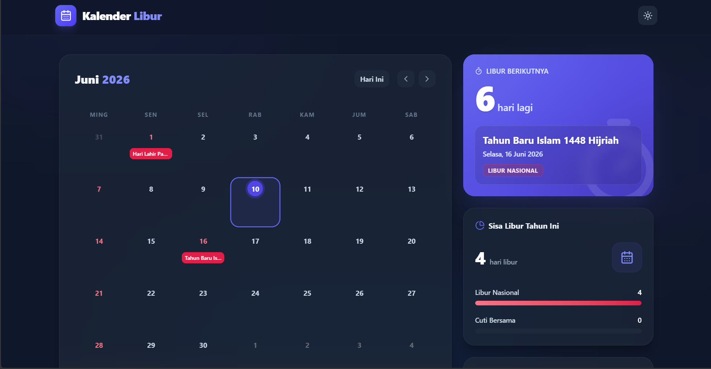

# Kalender Indonesia Web 🇮🇩📅

https://ferikhelix.github.io/kalender_indonesia_web/

A beautifully designed, modern, and production-ready Indonesian Holiday Calendar web application. Built entirely as a static client-side application, it provides blazing-fast performance with zero backend dependencies, making it perfect for GitHub Pages or offline use.

 *(You can add a screenshot here later!)*

## ✨ Features

* **Complete Holiday Data**: Includes verified National Holidays and Collective Leave (Cuti Bersama) spanning from 2024 to 2028.
* **Native-Feel Calendar Grid**: Features a fully swipeable, mathematically seamless calendar grid utilizing CSS scroll-snapping for a native iOS/Android feel.
* **Smart Holiday Insights**: View countdowns to the next holiday and see total remaining holidays for the year.
* **Search & Filter**: Instantly search for specific holidays or filter between "Libur Nasional" and "Cuti Bersama".
* **Premium UI/UX**: Designed with a sleek, modern, glassmorphism aesthetic inspired by Material Design 3 and Google Calendar.
* **Responsive & Mobile-First**: Works flawlessly on phones, tablets, and desktops.
* **Dark Mode**: Gorgeous slate-based dark mode for eye comfort.
* **Fully Static & Offline Friendly**: No API calls, no databases. Everything runs perfectly offline in your browser.

## 🛠️ Technology Stack

* **Framework**: [Preact](https://preactjs.com/) (Fast 3kB React alternative)
* **Build Tool**: [Vite](https://vitejs.dev/)
* **Language**: TypeScript
* **Styling**: [Tailwind CSS v4](https://tailwindcss.com/)
* **Date Manipulation**: `date-fns`
* **Icons**: `lucide-preact`

## 🚀 Getting Started

### Prerequisites

* Node.js (v18 or higher recommended)
* npm or pnpm or yarn

### Installation

1. Clone the repository:
   ```bash
   git clone https://github.com/yourusername/kalender-indonesia-web.git
   cd kalender-indonesia-web
   ```

2. Install dependencies:
   ```bash
   npm install
   ```

3. Run the development server:
   ```bash
   npm run dev
   ```

4. Open your browser and navigate to `http://localhost:5173`.

### Building for Production

To create a production-ready static build:

```bash
npm run build
```

This will generate a `dist` directory containing the optimized static files, ready to be deployed to GitHub Pages, Vercel, Netlify, or any static hosting service.

## 📂 Project Structure

* `src/components/` - Reusable UI components (Calendar, Holidays, Layout)
* `src/data/` - Static JSON-like data containing all holiday records
* `src/hooks/` - Custom Preact hooks for business logic
* `src/index.css` - Global styles and custom Tailwind theme tokens
* `src/app.tsx` - Main application entry point

## 🤝 Contributing

Contributions, issues, and feature requests are welcome! 

If you want to add new holidays for future years, you can simply update the `src/data/holidays.ts` file.

## 📝 License

This project is open-source and available under the [MIT License](LICENSE).
